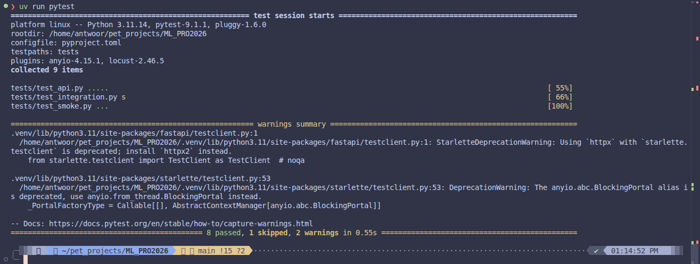
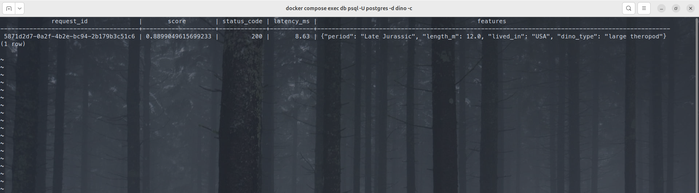
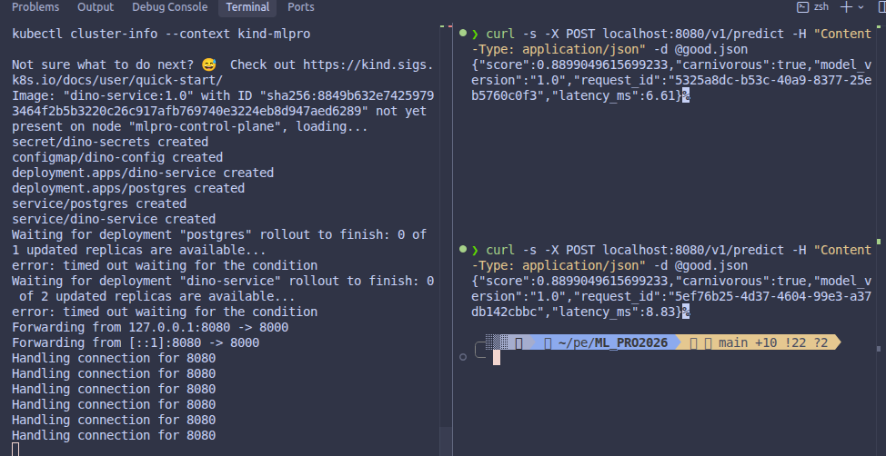
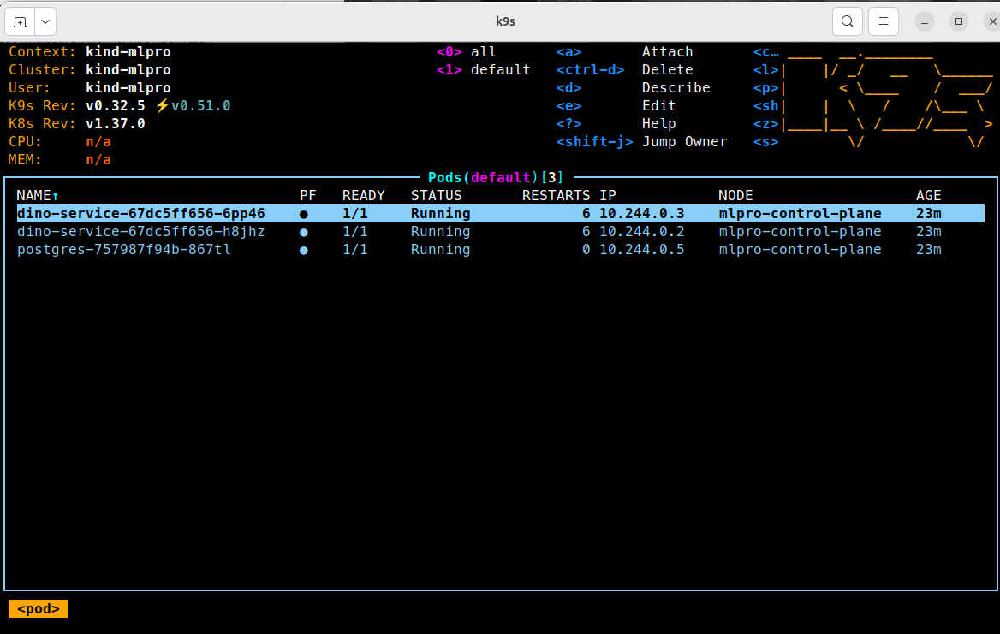

# Отчёт · домашка 1

Сервис предсказывает, хищный ли динозавр, по табличным признакам из датасета [Jurassic Park — The Exhaustive Dinosaur Dataset](https://www.kaggle.com/datasets/kjanjua/jurassic-park-the-exhaustive-dinosaur-dataset) на Kaggle (каталог Natural History Museum, ~310 родов).

Обучение: `notebooks/train_dino_diet.ipynb`. Бандл: `artifact/model.joblib` (`pipeline` + `metadata` с версией, порядком фичей и порогом 0.5).

Эндпоинты те же: `/health`, `/ready`, `/v1/predict`, автодоки `/docs`. В лог Postgres добавлено поле `status_code`.

## Скрины терминала на каждый чекпоинт


### 1. pytest

**Что снять:** окно терминала после `uv run pytest`. Должна быть зелёная сводка, все тесты `passed` (локально без `DATABASE_URL` интеграционный тест скипнется — это нормально; в CI он зелёный).



### 2. SELECT из таблицы логов
```bash
docker compose exec db psql -U postgres -d dino \
  -c "SELECT request_id, model_version, score, status_code, latency_ms, features FROM predictions;"
```




### 3. kubectl get pods + ответ /v1/predict через port-forward

**Что снять:** один кадр (или два соседних), где одновременно видно:

- `kubectl get pods` — два пода сервиса в `2/2 Running` (или `1/1 Running` у api, если смотреть сами поды приложения: важно, что **две реплики** `dino-service` в `Running`) плюс postgres;
- ответ `curl` на `POST localhost:8080/v1/predict` с телом из `good.json` после `kubectl port-forward svc/dino-service 8080:80`.

В JSON-ответе должны быть `score`, `carnivorous`, `model_version`, `request_id`, `latency_ms`.



> Плейсхолдер: `docs/screenshots/03_kind_pods_predict.png`

### 4. k9s с подами

**Что снять:** окно k9s по вашим подам. Подойдёт вид `:pods` или `:xray deploy`. Должны быть видны поды `dino-service` (две реплики) в кластере `mlpro`.

Запуск: при живом kind-кластере в отдельном терминале выполнить `k9s`.



## Журнал проблем
Было сложно найти задачу и понять, что нужно предиктить, потому динозавры)